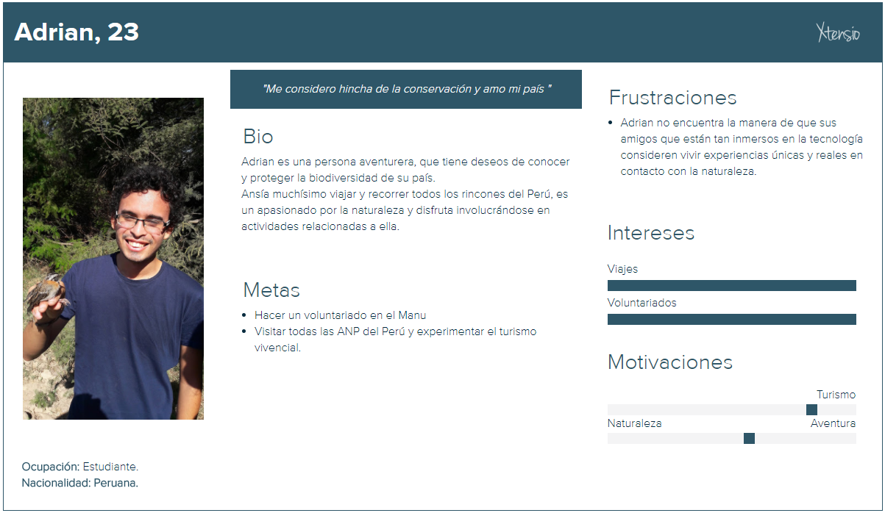

# Ecowasi App
Ecowasi App es una aplicación móvil que te conecta con la naturaleza. Es un espacio que te invita a experimentar el turismo vivencial en ANPs.

## Desarrollado para
[Laboratoria](http://laboratoria.la)

## Objetivos:

- Promover el ecoturismo responsable y el voluntariado en Áreas Naturales Protegidas (ANP)
- Dar a conocer la riqueza natural que poseen estas áreas y la importancia de su conservación.

## Antes de empezar: Términos claves

**- Áreas Naturales Protegidas (ANP)**
    
Son espacios marinos y terrestres del territorio nacional reconocidos, establecidos y protegidos legalmente por el Estado como tales, debido a que resguardan una gran diversidad de seres vivos y demás valores asociados de interés cultural, paisajístico y científico, así como por su contribución al desarrollo sostenible del país.

**- Servicio Nacional de Áreas Naturales Protegidas por el Estado (SERNANP)**

Es el organismo público encargado de conservar el patrimonio natural del Perú mediante la administración de 216 Áreas Naturales Protegidas.

**- Biodiversidad o diversidad biológica**

Según el Convenio Internacional sobre la Diversidad Biológica, es el término por el que se hace referencia a la amplia variedad de seres vivos sobre la Tierra.

## Problemática

El SERNANP no cuenta con suficientes productos digitales descargables para la difusión del turismo y la promoción de voluntariados en ANP. 

Su aplicación móvil 'Perú Natural' lanzada el 2014, actualmente se encuentra fuera de funcionamiento,  lo cual supone una desventaja al momento de intentar posicionar a las ANP en la oferta turística del país como destinos ideales para el turismo de naturaleza, aventura, cultura y recreación. Asimismo, la población necesita ser motivada y sentir suyas estas áreas, pues solo así se convertirán en aliados estratégicos para la conservación y cuidado de las mismas.

## Justificación del problema

En la búsqueda de medidas paliativas al problema nace 'Ecowasi App', una herramienta didáctica y educativa para el público en general, que busca difundir información y consejos valiosos tanto para visitar como para hacer voluntariado en seis principales ANP en la costa, sierra y selva del país. Es también relevante mencionar que al incrementarse las visitas a estas áreas, a través del cobro por la entrada, se genera una fuente de ingreso para mantener y proteger las ANP.

## Descubrimiento e Investigación

### Case Study:

- **Análisis del SERNANP**

    Existe una creciente tendencia mundial hacia la conservación del medio ambiente y la biodiversidad incluidos en los Objetivos de Desarrollo Sostenible (ODS), lo que ubica al Perú y a sus áreas naturales protegidas como destino de naturaleza, un sector que al año mueve $215 billones (OMT - Organización Mundial del Turismo).
    
    El impulso al turismo en las ANP se ha convertido en una de las mejores estrategias de conservación por su bajo impacto en el medio y por crear un efecto multiplicador en las economías locales. 

    

    **Posicionamiento actual**

    La estrategia actual que tiene el SERNANP para acercar a los turistas a las ANP es su portal web [Turismo naturaleza](www.turismonaturaleza.pe), la aplicación 'Perú camping' para los aficionados a los campamentos  y el _Pasaporte de las ANP_ que permite el ingreso a diez áreas protegidas al precio de seis, durante el periodo de 2 años, el cual se debe adquirir presencialmente en las sedes administrativas del SERNANP.

- **Benchmarking funcional**

    Se tomó como referencia aplicativos disponibles en Play Store con fines similares:

    

### User research

- **Encuestas online**

    **Fecha de difusión:** 13/03/2018.

    **Fecha de cierre:** 16/03/2018.

    [Link de encuestas](https://docs.google.com/forms/d/1eNeJjY8uq5aqFtQd49RaoLonVF1_Ge_L7-w0Yv3HcPc/edit#responses)

    **Resultados:**

    Fueron 20 los encuestados, personas con perfiles diversos de entre 20 y 50 años. 

    - El 100% disfruta de viajar y estar en contacto con la naturaleza.
    - Las ANP en orden de mayor preferencia son: 
    
        Parque Nacional del Manu
        
        Santuario Histórico de MachuPicchu
        
        Reserva Nacional de Paracas 
        
        Parque Nacional Tingo María 
        
        Reserva Nacional Tambopata
        
        Reserva Nacional Pacaya - Samiria.

    - El 94,4% desea tener una sección de voluntariados en ANP.
    - Al 100% le gustaría comprar el pasaporte de las ANP a través de la aplicación.
    - Al 94,4% le gustaría que mediante un juego acumulen puntos para acceder a descuentos en la compra de este Pasaporte.

- **Lo que opinan los expertos**
    
    Sandro Chávez Vásquez - Ex jefe del SERNANP:          

    > "Queremos comunicar que las áreas naturales no solo nos brindan paisajes hermosos, sino que nos dan una gran biodiversidad y numerosos servicios ambientales, como el agua y el clima. Se trata de todo un potencial que debemos cuidar."

    Ignacio March - Maestro en manejo y conservación de vida silvestre:

    > “La gente está cada vez más en las pantallas, en lo virtual, en contacto único y exclusivo con la tecnología, lo que ha provocado un síndrome que tiene distintos efectos. Lo que nosotros queremos es que la gente salga, conozca la importancia y el placer de estar en la naturaleza y así la proteja y la defienda.”

## Síntesis y definición

- **Affinity diagram**

    Posibilitó agrupar los insights de los usuarios en tres ítems claves:

    - Información específica de cada ANP
    - Información de voluntariados
    - Sugerencias.

    

## Ideación

- **Personas**
    
    

    
    
    

- **Problem Statements**
    
    - Raúl necesita encontrar información confiable y detallada sobre destinos naturales para planear su próximo viaje.

    - Raúl necesita un modo de ingresar a distintas ANP y no tener que hacer trámites cada vez que quiere visitar una.

    - Adrian necesita saber cuándo habrán cupos disponibles en la reserva a la cual quiere ir como voluntario.

    - Adrian necesita encontrar el modo de que mediante la tecnología sus amigos se interesen por conocer las ANP.
 
- **HMWs**

    - Organizar toda la información de áreas naturales en una aplicación móvil

    - Facilitar el ingreso de visitantes a diversas ANP a través de nuestra aplicación

    - Mostrar la información de voluntariados en nuestra aplicación

    - Usar la tecnología para llamar la atención de los jóvenes y se interesen en visitar las ANP

- **WHAT IF**

    - ¿WHAT IF algunas personas no saben qué es un ANP?

    - ¿WHAT IF nuestro ususarios no quieren registrarse para ingresar al aplicativo?

## MVP
----

### MoSCoW : Técnica de priorización de requerimientos

### Feature list

- Información de las seis ANP más populares entre los usuarios

- Información de programas de voluntariado disponibles en estas ANP

- Inscripción de voluntarios desde el aplicativo

- Compra online del Pasaporte de la Conservación

- Juegos para obtener descuento en el pasaporte.

### A/B testing

Se realizó el testing de lo siguiente:

- Layaout y/o diseño visual del aplicativo

- La organización de información y titulares del aplicativo

- La forma de presentación de las ANP

- Las imágenes (ubicación, tamaño, propósito y cantidad) contenidas en el aplicativo

- Nombre, diseño y guión de los juegos.

Participantes: Sofía (34), Roberto (36) y Lilia (8).

![][1] ![][2] ![][3]

[1]: assets/images/user1_opt.jpg "Roberto"

[2]: assets/images/user2_opt.jpg "Sofia"

[3]: assets/images/user3_opt.jpg "Lilia"

Se encontraron tendencias de comportamiento bastante similares que ayudaron a decidir mejoras en los flujos de compra de pasaporte, presentación de las ANP, diseño y guión de 3 de los 6 juegos.

## Prototyping / Testing

### Paper prototyping

Se diseñó y testeó un primer prototipo de baja fidelidad con tres participantes.

[Fotos del testing](https://photos.app.goo.gl/AyUGZJU877pFxPqD2)

### Prototipo

Se realizó una iteración del primer diseño de alta fidelidad hecho en Figma.

[Primera versión en Figma](https://www.figma.com/file/KXIyisXzzFPdayfgCqqQglgz/Ecowasi-app)

[Segunda versión en Figma](https://www.figma.com/file/CS1hPwcryy5v3ADBN6AMpi/Ecowasi-app-Copy?node-id=46%3A2)

Después de levantar correcciones en todo el flujo del aplicativo, se obtuvo el siguiente resultado:

[Última versión del prototipo en Marvel](https://marvelapp.com/4jb824f)

[Presentación en Marvel](https://marvelapp.com/4jb824f/screen/40082770)

### El valor contenido en Ecowasi

#### Información de ANPs:

La relevante por cada ANP (seis en total): 

- Breve descripción
- Actividades permitidas
- Horario de visita
- Tarifario actualizado
- Vías de acceso
- Imágenes de su biodiversidad
- Mapa de ubicación.

#### Programas de voluntariado disponibles:

Muestra la información que el voluntario requiere:

- Lo que ofrece como voluntario a la ANP
- Los beneficios que obtiene
- Requisitos
- Número de vacantes
- Duración del voluntariado
- PDF adjunto con detalles del programa.

Se puede acceder a ella sin haberse registrado o iniciado sesión.

#### Postulación a voluntariados desde el app

El proceso es fácil y rápido. Solo se debe iniciar sesión, llenar los datos y adjuntar los archivos que se solicitan.

#### Compra de pasaporte de la Conservación

Solo si estás registrado o si iniciaste sesión. El proceso es muy sencillo: llenas tus datos, adjuntas una fotografía, realizas el pago y listo.

#### Gamification: Juegos de ANPs

El aplicativo cuenta con 6 juegos, cada uno de cada ANP, con el propósito de motivar a grandes y chicos a que conozcan y valoren la biodiversidad que hay en estas áreas, más que obtener ecopuntos para el 20% de descuento en la compra del pasaporte, el objetivo es crear conciencia ambiental de forma lúdica.

Por el momento solo se cuenta con los personajes y el guión del primer nivel de cada juego y 
también se debe iniciar sesión para acceder a ellos.

## Conclusiones

Si bien es un MVP con mejoras que añadir, el corazón de este proyecto es su contenido y el valor que puede tener tanto para los que buscan información sobre ANPs y voluntariados, para los que ya conocen un pedacito de lo maravilloso de la vida natural y quieren seguir encantándose con ella, como para los que no sabían incluso que era un ANP, y en especial va dedicado a estos últimos, porque no se puede amar lo que no se conoce.

